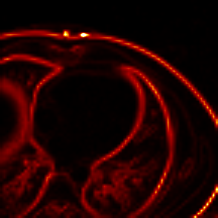

# GradientDifferenceLoss_3D
Gradient difference loss (GDL) function for 3D images implemented in PyTorch. 

Below are shown an example CT attenuation map and its 3D gradient image for reference.  
Original image:

Gradient image:

